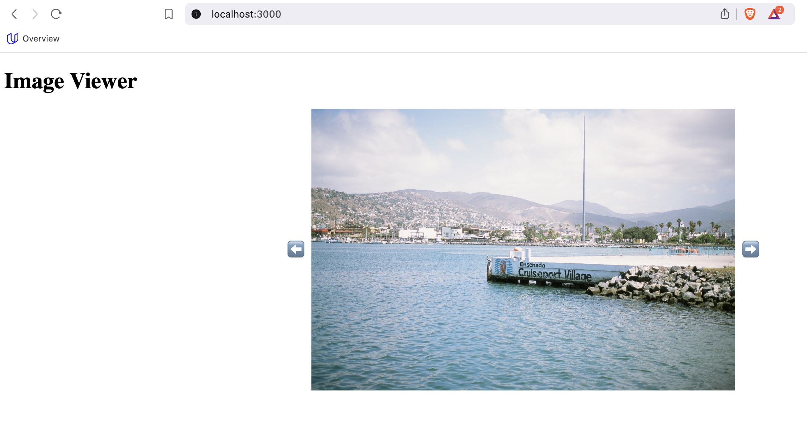
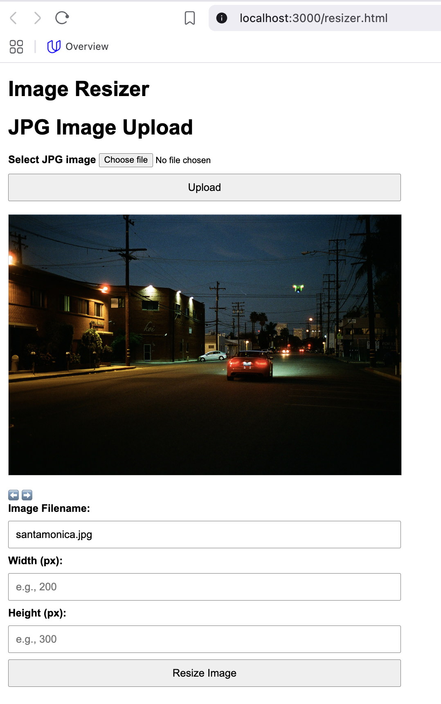

# Project: Image Resizer and Viewer

This project provides a simple Node.js web server with the following features:

1. A page to view a gallery of images.
2. A resizing tool to dynamically generate thumbnails based on user-defined dimensions.
  - The resized images are cached and will be served from the thumbnail folder if an image
     in that size already exists.

## Prerequisites

### For Nix Users
- Installing [Nix](https://nixos.org/download.html) is beyond the scope of this documentation,
  but if you have a running Nix Package Manager with support for flakes, you can use it to run
  the project in an isolated environemnet.

### For Non-Nix Users
- Install [Node.js](https://nodejs.org/) (version 23.2 or higher).
- Install [Yarn](https://yarnpkg.com/) (version 1.22.22 or latest stable version).
- Install TypeScript globally:
  ```bash
  yarn global add typescript
  ```

---

## Setup Instructions

### For Nix Users
1. Clone the repository:
   ```bash
   git clone https://github.com/oforero/cd0292-building-a-server-project-starter.git
   cd cd0292-building-a-server-project-starter
   ```

2. Enter the Nix shell with the provided flake:
   ```bash
   nix develop
   ```

3. Install dependencies:
   ```bash
   yarn install
   ```

4. Build the project:
   ```bash
   yarn build
   ```

5. Start the server:
   ```bash
   yarn start
   ```

6. Open your browser and navigate to:
   - **Gallery Page**: [http://localhost:3000](http://localhost:3000)

      

   - **Resizer Page**: [http://localhost:3000/resize.html](http://localhost:3000/resize.html)

      

### For Non-Nix Users

1. Clone the repository:
   ```bash
   git clone https://github.com/oforero/cd0292-building-a-server-project-starter.git
   cd cd0292-building-a-server-project-starter
   ```

2. Install dependencies:
   ```bash
   yarn install
   ```

3. Build the project:
   ```bash
   yarn build
   ```

4. Start the server:
   ```bash
   yarn start
   ```

5. Open your browser and navigate to:
   - **Gallery Page**: [http://localhost:3000](http://localhost:3000)
   - **Resizer Page**: [http://localhost:3000/resize.html](http://localhost:3000/resize.html)

### Running The Tests

1. The image resize caching contains Jasmine tests, this are runin using:

   ```bash
   yarn test
   ```

---

## How to review

### Endpoints

** To avoid further misunderstandings I mapped the resizer to the `/images` endpoint,
   and added a new endpoint to show the original pictures `/original`  **
1. The image endpoint has different options:

1.1. Endpoint listing the existing images: [http://localhost:3000/images/list](http://localhost:3000/images/list).
1.2. Endpoint showing an image: [http://localhost:3000/images/:imagename](http://localhost:3000/images/:imagename).
  - Note the image name is passed as part of the URL and not as a parameter, I think this is a better API design
1.3. Endpoint showing an resized image: [http://localhost:3000/resize/:imagename?width=300&height=200](http://localhost:3000/images/:imagename?width=300&height=200).
  - It is a different endpoint as the image one, and it implement the requested caching behaviour.
  - it also takes the image name as part of the URL, not as a parameter.

### **Gallery Page**
The gallery page displays all the images in the `images` folder. Simply navigate to [http://localhost:3000](http://localhost:3000) to view the available images.

  

### **Image Resizer Page**
The resizer tool allows users to input the dimensions for resizing an image:

1. Navigate to the Resizer Page: [http://localhost:3000/resize.html](http://localhost:3000/resize.html).

    

2. Enter the filename of an image (e.g., `encenadaport.jpg`).
3. Enter the desired `width` and `height` in pixels.
4. Click "Resize Image."
5. The resized image will be displayed below the form, along with the URL to fetch the thumbnail directly.
6. The URL of the resized image will be printed in a text box (e.g., `http://localhost:3000/resize/encenadaport.jpg?width=300&height=200`) under the Thumbnail,
   this URL can be used to reuse the thumbnail in other pages


---

## Notes
- Resized images are cached in the `thumbnails` directory to improve performance.
- Ensure the `images` folder contains images in supported formats (`.jpg`, `.png`, etc.).

For any issues or questions, feel free to open an issue on the repository!
